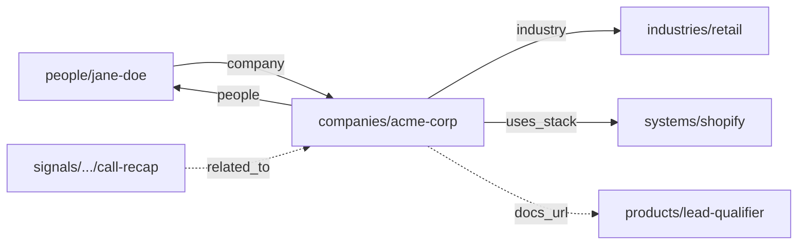

# The AI-Native Company

> A company's context layer for humans and AI agents. Just Markdown and Git.

[](LICENSE)
[](https://github.com/danivellagit/ai-native-company-template/actions/workflows/link-check.yml)


AI agents are only as good as the context they read. In most companies that context is scattered across chat threads, a wiki nobody updates, a CRM only one team opens, and people's heads. So every new hire rebuilds it by hand, and every AI tool starts from zero on every single prompt.

This repo is a different bet: **curate your company's context once, as plain Markdown in Git, and let every teammate and every AI agent read the same files.** Claude, Cursor, Codex, ChatGPT, all of them boot from the same source of truth. No vector database, no platform to buy, no lock-in. When you want to change how the agents behave, you edit a file and commit it.

It is a **blank, open template.** Clone it, fill in your company, and you have a living brain that humans and agents share. The rest of this page explains how it is built and how to make it yours.

---

## Why this exists

Wrong context makes a model hallucinate. Stale context makes it repeat last quarter's mistake. No context makes it produce confident nonsense. The usual fixes all fall short:

- **Do nothing.** Outputs drift and nobody can say what the agent actually knows.
- **Vector database.** Good for fuzzy search, weak for governance. The model still invents facts that are not in the corpus.
- **An AI platform.** Expensive, rigid, and it breaks the moment the business changes.

Curating the context yourself, as files in Git, gives you something the others cannot: context that is **structured**, **current**, **owned** (a human edited it), and **auditable** (every change is a commit). And it compounds. Every call you log and every entity you add makes the next agent run better.

---

## The model in one minute

Two tiers, and that is the whole thing.

1. **Canon** ([`canon/`](canon/)) is *prescriptive*: who you are, how you talk, what you never say, how the graph is shaped, who is on each team. The constitution plus the operating manual. **Every change goes through a pull request**, so the rules never drift by accident.
2. **Everything else** is *descriptive*: people, companies, products, the things that happened (signals), reusable agent behaviors (skills). **Push straight to `main`**, no ceremony. The cost of a wrong write is one revert.

**Two ways to write:** an AI agent through a skill, or a human in any Markdown editor.
**One way to publish:** the agent commits and pushes (a `SessionStart` hook pulls, a `Stop` hook commits and pushes what changed). A new hire reads the same files the agent reads. That is what AI-native means here.

---

## What is in here

| Path | What it holds |
|---|---|
| [`CLAUDE.md`](CLAUDE.md) / [`AGENTS.md`](AGENTS.md) | The boot file every AI agent reads first: who the user is, what order to load the rules in, the hard rules. Two mirrored files for tools that use either convention. |
| [`canon/`](canon/) | The rules. `company-rules.md` (identity, voice, exclusions), `operations.md` (how the agent works), `anatomy.md` (how the graph is shaped), `profile.md` (the facts), and `canon/team/<team>.md` per team. PR-gated. |
| [`people/`](people/), [`companies/`](companies/) | One file per human and per organization. Internal entries are rich (scope, voice); external ones stay light and point to your CRM. |
| [`products/`](products/) | One thin pointer per AI agent or automation you build or sell. The full spec lives in your docs system. |
| [`industries/`](industries/), [`systems/`](systems/), [`themes/`](themes/), [`job-titles/`](job-titles/), [`relationship-types/`](relationship-types/) | The shared taxonomy the graph snaps to, so a term means the same node everywhere. |
| [`signals/`](signals/) | What happened, on the record: call recaps, email digests, manual notes. Append-only, dated, cross-cutting. The company's running memory. |
| [`skills/`](skills/) | Reusable agent behaviors, each a Markdown file an agent follows step by step. Ships with one generic example, [`meeting-recap`](skills/meeting-recap/). |
| [`team/`](team/) | One folder per team, a thin index of who is on it. |

Ownership is confined (a team lead edits their slice, canon moves only by PR) but reads are open: everyone, and every agent, reads everything. The whole repo is the context.

---

## How the graph works: wikilinks

This is the part that turns a pile of Markdown into something an agent can navigate.

In each file's frontmatter, entities point at each other with double-bracket links: `[[acme-corp]]`, `[[jane-doe]]`, `[[shopify]]`. The links are **bidirectional and written on both sides**: a person's file says `company: [[acme-corp]]`, and the company's file lists `people: [[jane-doe]]`. So from any node you can see both who it points to and who points to it.



The graph is dense and shallow: from any starting point an agent reaches the rest of the relevant context in one to three hops, never a blind search. Ask an agent to prep a call with Acme and it opens `companies/acme-corp.md`, follows `industry` to learn how you talk to that vertical, follows `people` to see who the buyer is, follows `uses_stack` to see their software, and pulls the recent `signals` that mention them. No copy-paste, no "let me give you some background." Plain text, but wired.

Queries like "every person at Acme", "every customer on Shopify", or "every call that touched pricing" become one-hop lookups.

---

## Quick start

```bash
git clone https://github.com/danivellagit/ai-native-company-template.git
cd ai-native-company-template
```

Then fill it in, in this order. The repo is useful after step 3.

1. **Rename the home company.** Search the repo for `<COMPANY>` and `<company>` and replace with your name and slug. Create `companies/<company>.md` with `is_self: true` from [`companies/_TEMPLATE.md`](companies/).
2. **Fill the profile.** [`canon/profile.md`](canon/profile.md): leadership, team leads, the tools you use, mission, goals. The facts file every agent reads.
3. **Write the constitution.** [`canon/company-rules.md`](canon/company-rules.md): identity, positioning, voice, exclusions. The `_TBD_` blocks are guided.
4. **Set your teams.** The example set is leadership, sales, marketing, product, engineering, customer-success. Rename or add to match your org (`canon/team/<team>.md` and `team/<team>/<team>.md`).
5. **Wire your tools.** Replace the `<CRM>`, `<transcript tool>`, `<docs system>`, `<email>` placeholders with the tools you actually use, and connect them as MCP servers.
6. **Open it in an agent** (Claude Code, Cursor, Codex) and try the [`meeting-recap`](skills/meeting-recap/) skill on a real transcript. Watch it write the first signal into your graph.

Every folder ships a `README.md` (the schema) and a `_TEMPLATE.md` (a copy-paste starting point). Read those when you need them.

---

## How changes happen

| You want to change | You edit | Process |
|---|---|---|
| Voice, exclusions, who wins on conflict | [`canon/company-rules.md`](canon/company-rules.md) | Pull request, owner-approved |
| How the agent operates | [`canon/operations.md`](canon/operations.md) | Pull request |
| The shape of the graph | [`canon/anatomy.md`](canon/anatomy.md) | Pull request |
| Company facts | [`canon/profile.md`](canon/profile.md) | Pull request |
| A person, company, product, taxonomy entry | the relevant folder, per its README | Push direct to `main` |
| A reusable agent behavior | [`skills/<slug>/SKILL.md`](skills/) | Push direct |
| An on-record signal | `signals/<source>/YYYY/MM/...` | Push direct, via a skill |

Canon is **PR-only**, enforced by a GitHub ruleset on `canon/**` (see [`.github/CANON-ENFORCEMENT.md`](.github/CANON-ENFORCEMENT.md)). Everything else is push-direct, because the cost of a wrong write is one revert and the cost of friction is constant.

---

## Design principles

- **Context is the product.** Agents do not need fancier models, they need better context.
- **Markdown is the API.** If you cannot read your context in a text editor, you do not own it.
- **Git is the database.** Audit, diff, blame, revert, all free.
- **The owner writes the rules.** Governance is a file, not code.
- **Agents read what humans read.** Same files, same precedence, same exclusions.
- **No vendor lock-in.** Switch AI tools any time. The brain stays in your repo.

---

## License

[MIT](LICENSE). Use it, fork it, make it your company's own.
