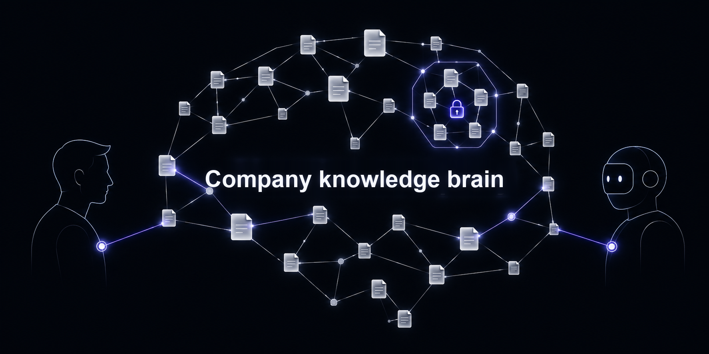
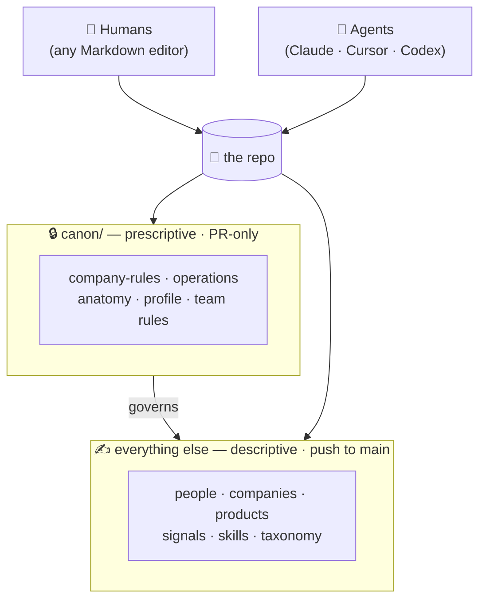
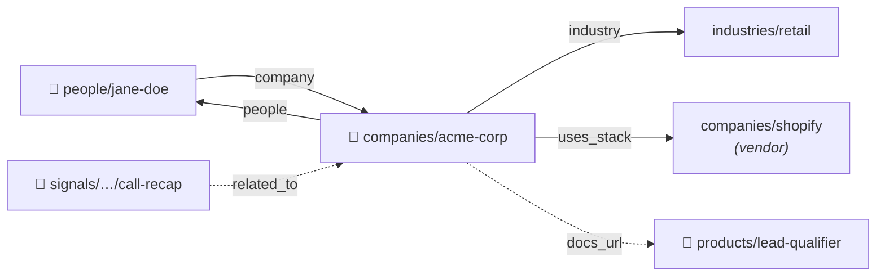

<!-- markdownlint-disable MD033 MD041 -->
<div align="center">



# The Company Knowledge Brain

**Your company's brain — one folder of Markdown that humans and AI agents both read.**

No vector database. No platform to buy. No lock-in. Just files in Git.

[](LICENSE)
[](https://github.com/danivellagit/company-knowledge-brain-template/actions/workflows/link-check.yml)


</div>

---

> **The idea in three lines.**
> AI agents are only as good as the context they read. Most companies scatter that context across chat, a stale wiki, a CRM one team opens, and people's heads — so every agent starts from zero on every prompt.
> This repo curates it **once**, as plain Markdown in Git, and every teammate *and* every agent boots from the same source of truth.

When you want to change how the agents behave, you **edit a file and commit it**. That's the whole product.

It ships as a **blank, open template**: clone it, fill in your company, and you have a living brain that humans and agents share.

---

## Why not the usual fixes

Wrong context makes a model hallucinate. Stale context makes it repeat last quarter's mistake. No context makes it produce confident nonsense.

| Approach | What you get | Where it breaks |
|---|---|---|
| **Do nothing** | Context in heads and chat | Outputs drift; nobody can say what the agent knows |
| **Vector database** | Fuzzy search over a corpus | Weak governance; the model still invents facts |
| **An AI platform** | A product to configure | Expensive, rigid, breaks when the business changes |
| **This repo** | Structured files in Git | *(the trade you're making)* You curate it yourself |

Curating it yourself buys the four things the others can't: context that is **structured**, **current**, **owned** (a human edited it), and **auditable** (every change is a commit). And it compounds — every call you log makes the next agent run better.

---

## The model in one minute

Two tiers. That's the whole thing.



- **Canon** ([`canon/`](canon/)) is the constitution plus the operating manual: who you are, how you talk, what you never say, how the graph is shaped, who's on each team. **Every change is a pull request**, so the rules never drift by accident.
- **Everything else** is descriptive: people, companies, products, what happened (signals), reusable agent behaviors (skills). **Push straight to `main`** — the cost of a wrong write is one revert.

**Two ways to write** — an AI agent through a skill, or a human in any Markdown editor.
**One way to publish** — the agent commits and pushes (a `SessionStart` hook pulls, a `Stop` hook commits what changed). A new hire reads the exact files the agent reads. *That* is what AI-native means here.

---

## What's in the repo

```text
company-knowledge-brain/
├── CLAUDE.md · AGENTS.md      # boot file every agent reads first (mirrored)
├── canon/                     # 🔒 the rules — PR-only
│   ├── company-rules.md       #    identity, voice, exclusions
│   ├── operations.md          #    how the agent works
│   ├── anatomy.md             #    how the graph is shaped
│   ├── profile.md             #    the company facts
│   └── team/<team>.md         #    per-team rules + who's on the team
├── people/  · companies/      # one file per human / organization
├── products/                  # thin pointers to the agents you build or sell
├── industries/ · themes/      # the shared taxonomy the graph snaps to
│   · job-titles/ · relationship-types/
├── signals/                   # what happened, on the record (append-only)
│   ├── daily-call/  ├── email/  └── manual/
└── skills/                    # reusable agent behaviors, one folder each
```

Every folder ships a `README.md` (its schema) and a `_TEMPLATE.md` (a copy-paste starting point).

**Ownership is confined, reads are open.** A team lead edits their slice; canon moves only by PR. But everyone — and every agent — reads everything. The whole repo is the context.

---

## The trick: a graph made of wikilinks

This is what turns a pile of Markdown into something an agent can *navigate*.

In each file's frontmatter, entities point at each other with double-bracket links — and the link is **written on both sides**. A person's file says `company: [[acme-corp]]`; the company's file lists `people: [[jane-doe]]`. So from any node you see both who it points to and who points to it.



The graph is **dense and shallow**: from any starting point an agent reaches the rest of the relevant context in one to three hops — never a blind search. Queries like *"every person at Acme"*, *"every customer on Shopify"*, or *"every call that touched pricing"* become one-hop lookups.

<table>
<tr><td>

**A day in the life** — you ask an agent to prep a call with Acme. With no copy-paste and no "let me give you some background," it:

</td></tr>
<tr><td>

1. opens `companies/acme-corp.md`
2. follows `industry` → how you talk to that vertical
3. follows `people` → who the buyer is
4. follows `uses_stack` → the software they run
5. pulls recent `signals` that mention them

Plain text, but wired.

</td></tr>
</table>

---

## Quick start

```bash
git clone https://github.com/danivellagit/company-knowledge-brain-template.git
cd company-knowledge-brain-template
```

Then fill it in, in this order. **The repo is useful after step 3.**

1. **Name the home company.** Search for `<COMPANY>` / `<company>` and replace with your name and slug. Create `companies/<company>.md` with `is_self: true` from [`companies/_TEMPLATE.md`](companies/).
2. **Fill the profile** — [`canon/profile.md`](canon/profile.md): leadership, team leads, the tools you use, mission, goals.
3. **Write the constitution** — [`canon/company-rules.md`](canon/company-rules.md): identity, positioning, voice, exclusions. The `_TBD_` blocks are guided.
4. **Set your teams.** The example set is leadership, sales, marketing, product, engineering, customer-success — rename or add to match your org, one file each at `canon/team/<team>.md`.
5. **Wire your tools.** Replace the `<CRM>`, `<transcript tool>`, `<docs system>`, `<email>` placeholders with what you actually use, and connect them as MCP servers.
6. **Open it in an agent** (Claude Code, Cursor, Codex) and run the [`meeting-recap`](skills/meeting-recap/) skill on a real transcript. Watch it write the first signal into your graph.

---

## How changes happen

| You want to change | You edit | Process |
|---|---|---|
| Voice, exclusions, who wins on conflict | [`canon/company-rules.md`](canon/company-rules.md) | 🔒 Pull request, owner-approved |
| How the agent operates | [`canon/operations.md`](canon/operations.md) | 🔒 Pull request |
| The shape of the graph | [`canon/anatomy.md`](canon/anatomy.md) | 🔒 Pull request |
| Company facts | [`canon/profile.md`](canon/profile.md) | 🔒 Pull request |
| A team's rules or roster | [`canon/team/<team>.md`](canon/team/) | 🔒 Pull request |
| A person, company, product, taxonomy entry | the relevant folder, per its README | ✍️ Push to `main` |
| A reusable agent behavior | [`skills/<slug>/SKILL.md`](skills/) | ✍️ Push to `main` |
| An on-record signal | `signals/<source>/YYYY/MM/…` | ✍️ Push, via a skill |

Canon is **PR-only**, enforced by a GitHub ruleset on `canon/**` (see [`.github/CANON-ENFORCEMENT.md`](.github/CANON-ENFORCEMENT.md)). Everything else is push-direct — the cost of a wrong write is one revert, and the cost of friction is constant.

---

## Design principles

- **Context is the product.** Agents don't need fancier models, they need better context.
- **Markdown is the API.** If you can't read your context in a text editor, you don't own it.
- **Git is the database.** Audit, diff, blame, revert — all free.
- **The owner writes the rules.** Governance is a file, not code.
- **Agents read what humans read.** Same files, same precedence, same exclusions.
- **No vendor lock-in.** Switch AI tools any time; the brain stays in your repo.

---

## License

[MIT](LICENSE). Use it, fork it, make it your company's own.
